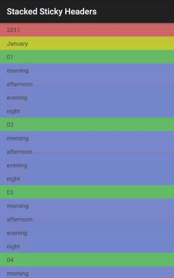

StackedStickyHeaders
====================

An android library for multiple hierarchically related section headers that stick to the top of a ListView.

### Usage

1. Add the StackedStickyHeadersView either to an XML layout file, or programmatically.
2. Set the list adapter by calling the StackedStickyHeadersView.setAdapter(ListAdapter listAdapter)
3. Call the initStickyHeaders(int[] headersAdapterViewTypes, int[] headerViewsHeights) to initialize the sticky headers. Make sure the adapter is not empty when you call this method.
4. Use StackedStickyHeadersView.getListView() to access the internal ListView for setting click listeners for example

### Possible future improvements
- dynamic automatic initialization of sticky headers
- support for RecyclerView
- click listeners for the sticky headers
